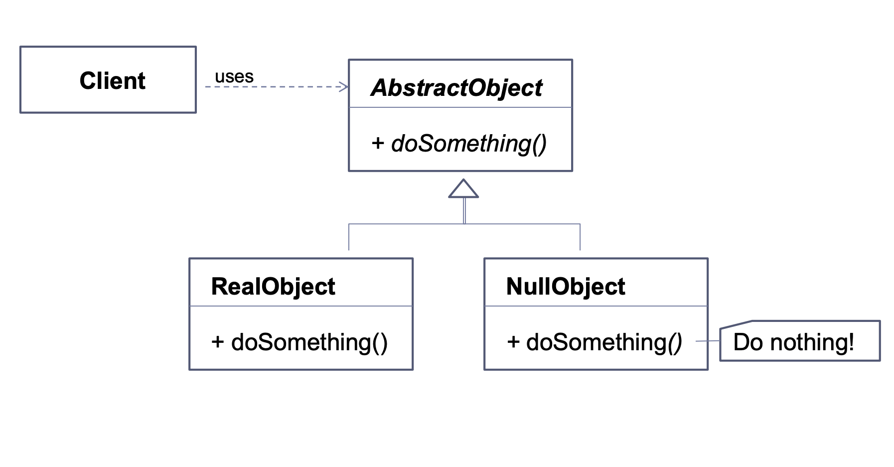

# Null Object Pattern (Behavioral)

In object-oriented computer programming, a null object is an object with no referenced value
or with defined neutral ("null") behavior.
The null object design pattern describes the uses of such objects and their behavior (or lack thereof).

## Intent

It completely removes the idea of null by representing the
nothingness with a piece of data that is functional. It will therefore
provide the null object as a surrogate for the lack of
an object of a certain type.

* It limits checks for null to one central location to avoid
null pointer exceptions

* this pattern seems to defer null checks since it returns an
  object that does nothing but then methods are called on the
  objects and the results should be checked

* this pattern only makes sense when there is a reasonable,
  functional value for the null object to be (e,g, a
  list/array/hashmap/collection)

## Useful when

The main use is to avoid null values and the pyramids of logic they can cause. We then abstract the logic
for the null object to avoid special if blocks everywhere.

the client is not aware if the real object or the null object is called so the
if section is removed from client implementation


## Typical examples

* provide anonymous access to a specific service which requires some User object

## UML Diagram



## Implementation

The NullObject class is often implemented as a singleton

<!-- tabs:start -->

#### ** Kotlin **

```kotlin
    interface User {
        val id: Int
        val name: String
        val phone: String
    }

    object EmptyUser : User {
        override val id: Int = -1
        override val name: String = "Anonymous"
        override val phone: String = "0000000"
    }

    data class User(
        override val id: Int,
        override val name: String,
        override val phone: String
    ): User
```

#### ** Java **

```java
    interface User {
        public int getId();
        public String getName();
        public String getPhone();
    }

    class EmptyUser implements User {
        private int id = 0;
        private String name = "Anonymous";
        private String phone = "0000000";

        public int getId() {
            return this.id;
        }

        public String getName() {
            return this.name;
        }

        public String getPhone() {
            return this.phone;
        }
    }

    class User implements User {
        private int id;
        private String name;
        private String phone;

        // To illustrate the mandatory construction of the object values
        public User(int id, String name, String phone) {
            this.id = id;
            this.name = name;
            this.phone = phone;
        }

        public int getId() {
            return this.id;
        }

        public String getName() {
            return this.name;
        }

        public String getPhone() {
            return this.phone;
        }
    }
```
<!-- tabs:end -->

## Known uses

**Examples of null objects in the JDK**
* ```java.util.Collections``` with methods ``` emptyList(), emptyMap(), emptySet()```

## Other

* The null object pattern can be used with the **template
method pattern**

* The null object can be used with the **factory pattern**
